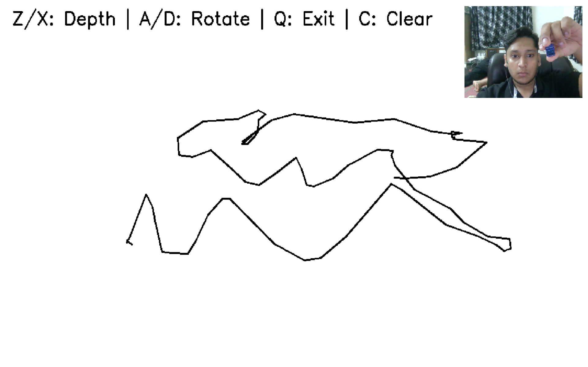
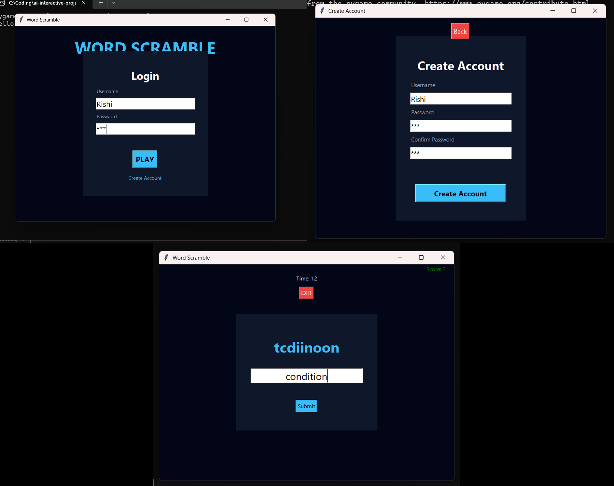
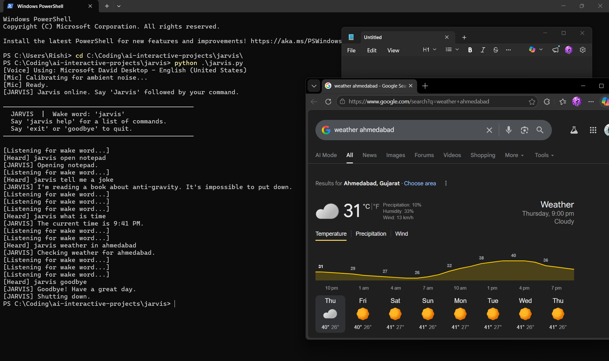

# 🎮 AI Interactive Projects

A collection of interactive Python projects combining computer vision, AI, and game development.

---

## 🎨 3D Air Drawing App
Draw in air using your webcam with neon glow effects and layered 3D visualization.

### Features:
- Camera-based drawing
- Neon glow strokes
- Layered 3D illusion
- Fullscreen canvas



---

## 🎮 Word Scramble Game
A GUI-based word game with login system and score tracking.

### Features:
- Multiple users
- Score saving system
- UI-based gameplay



---

## 🤖 Jarvis AI Assistant
A simple voice assistant capable of performing automation tasks.

### Features:
- Voice command support
- Task automation
- Interactive responses



---

## 🛠️ Technologies Used
- Python
- OpenCV
- Pygame
- Tkinter

---

## 🚀 How to Run

Clone the repository:
```bash
git clone https://github.com/chandwanirishi1212/ai-interactive-projects.git
